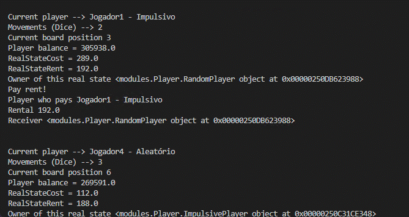

<h1 align="center">
   <p> Monopoly Simulation 🐍</p>  
</h1>

<br>

<h1 align="center">
  
</h1>

---
## 🧾 About
**MonopolySimulation** is a Python project to simulate 300 times a simplified Monopoly board game. The simulation occurs with four players based on special behavior rules considering their atitude in business. 

---
## 🕖 Versioning
- MonopolySimulation v1.0 (relased in 13/07/2022)

---
## ✅ Main features
- [x] Time-out ended games.
- [x] Median time per game. 
- [x] Percent of victories by player.   
- [x] Winner behaviour.   

---
## 🔧 Technology
- [Python](https://www.python.org/) 💚

---
## 👨‍💻 How to Setup
  
```bash
  # Clone the project
  $ git clone https://github.com/abelgonzalez/MonopolySimulation.git
```
```bash
  # Enter directory
  $ cd MonopolySimulation
```

 
---
## 😎 How to Run
- By default we have 300 simulations and timeout of 1000. To change it, enter in scr/main.py and edit the variable **quantOfSimulations** or **timeoutValue** for timeout rule.
 
- In src folder (**MonopolySimulation**) run:
  ```bash
    # Run
    $ python main.py
  ```

---
## 👉 Additional information
* In case of sensitive bugs like security vulnerabilities, don't hesitate to contact me at abelgodev@gmail.com instead of using the issue tracker. I value your effort to improve the security and privacy of this project!

---
## 📝 License
This project is under the MIT license. See the file <a href="https://github.com/abelgonzalez/MonopolySimulation/LICENSE">LICENCE</a> for more details.

---
## 🧑‍💻 Autor
<p align="center">Done with 💙 by Abel González Mondéjar</p>


[](https://www.linkedin.com/in/abelgonzalezmondejar/)
